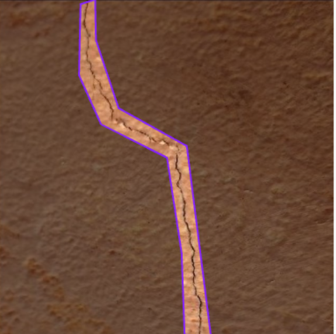
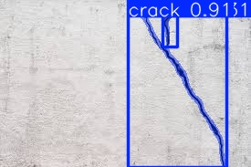

# CrackDetectionOnJetsonNano

**Project Overview**  
This project implements **Real-time crack detection and segmentation** on the **NVIDIA Jetson Nano** using deep learning. It identifies cracks at **pixel-level precision**, making it suitable for industrial inspection, quality control etc.  
This project also includes a **Streamlit application** to run real-time crack detection using the trained YOLOv8 model (`best.pt`). Users can upload images or videos and get **annotated results with crack counts**.

Key Features:  
- Real-time inference on Jetson Nano.  
- Pixel-level crack segmentation for accurate localization.  
- Easily adaptable to industrial production lines or equipment monitoring.  
- Optimized for edge devices with limited compute resources.  

## Setup and Model Download

Before running the detection, you need to install required libraries and download the trained model.

### 1. Install Dependencies
```bash
sudo apt-get update
sudo apt-get install python3-pip
pip3 install torch torchvision torchaudio
pip3 install opencv-python numpy matplotlib
```

## Training Details

The crack detection model is based on **YOLOv8** and was trained on a custom dataset annotated with **RoboFlow**.  

- **Dataset:** Images of cracks in industrial materials, annotated at pixel-level for segmentation. 
- **Platform:** RoboFlow for dataset management and augmentation. (Sample dataset = https://universe.roboflow.com/apex-30psh/apex-crackai)
- **Model:** YOLOv8 segmentation model (`yolov8s-seg`).  (https://github.com/ultralytics/ultralytics)
- **Training Steps:**
  1. Export dataset from RoboFlow in YOLOv8 format.
  2. Train the model using Ultralytics YOLOv8 on GPU:
     If you are running inside a Docker container, you may want to skip automatic dependency installation to avoid conflicts:
     ```bash
     pip install ultralytics --no-deps
     ```
     Otherwise
     ## Training YOLOv8 on Jetson Nano
    
    Due to limited GPU memory (8GB), we restrict resources during training:
    
    - **Batch size:** 4  
    - **Number of workers:** 0 (to avoid CPU memory issues)  
    - **Image size:** 640 (can reduce if memory is low)  

    ### Example Training Command
    ```python
    from ultralytics import YOLO
    
    # Load YOLOv8 segmentation model
    model = YOLO('yolov8s-seg.pt')
    
    # Train on custom dataset with limited resources
    model.train(
        data='dataset.yaml',   # path to your dataset config
        epochs=50,            # number of epochs
        imgsz=320,             # input image size
        batch=4,               # small batch size for Jetson
        workers=0              # avoid memory issues
    )
    
    ```
  4. Save the trained weights (`crack_model.pt`) for deployment.

  
  Once the model is trained or downloaded, you can run inference on images or video streams directly on the Jetson Nano.
  
  5. Inference on a Single Image
  ```python
  import cv2
  from ultralytics import YOLO
  
  # Load trained model
  model = YOLO('best.pt')
  
  # Read image
  img = cv2.imread('sample_image.jpg')
  
  # Run inference
  results = model.predict(img)
  
  # Visualize results
  results.show()  # Opens window with detected cracks
  ```
  6. Inference on Video or webcam
  ```python
  cap = cv2.VideoCapture(0)  # Use 0 for default camera or path to video

  while cap.isOpened():
      ret, frame = cap.read()
      if not ret:
          break
  
      results = model.predict(frame)
      frame_result = results[0].plot()  # Draw predictions on frame
  
      cv2.imshow('Crack Detection', frame_result)
  
      if cv2.waitKey(1) & 0xFF == ord('q'):
          break
  
  cap.release()
  cv2.destroyAllWindows()
  ```

### Sample Raw Image,                                          Class Annotated Image,                                           Layer Annotated Image
         


### Model Inference Result


## Streamlit Setup on Jetson Nano (8GB)

To run the crack detection web app on a Jetson Nano, follow these steps:

### 1. Update system packages and download Streamlit
```bash
sudo apt-get update
sudo apt-get upgrade -y
pip3 install streamlit --no-deps
```


